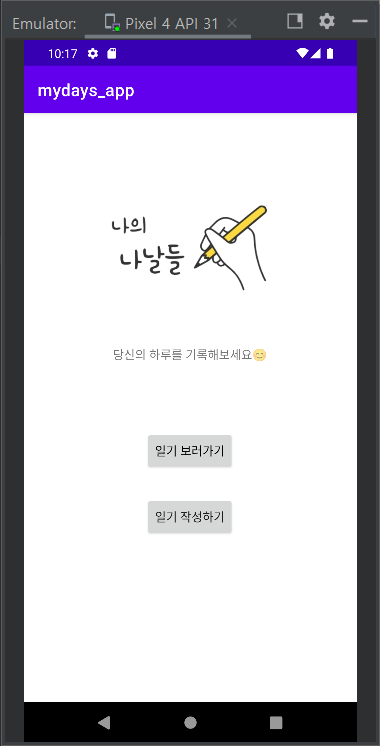

# Kotlin-Diary

날짜: 2022년 11월 27일 
유형: 과제, 어플

 

## 📌 실행화면

메인 화면 

일기 보러가기 클릭시 - 목록 

한 칸 클릭 시 

수정 테스트 

일기가 수정 된 모습 

일기 삭제 버튼 클릭시 

일기 쓰러가기 클릭시 

날짜 선택 클릭시 

날짜 선택 완료시 

내용이 비었을 때 추가 안 됨 

내용 입력 후 버튼 클릭시 추가 

날짜 중복 ⇒ 오류문구, 추가 X 

